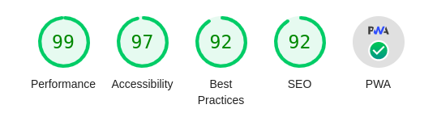

## Introduction

We all love apps, right?  They're easy to use and at least in theory are verified and provided by a trusted source.  But something about apps, in their current state, just doesn't feel right to an open source enthusiast, does it?  Sure, there's [F-Droid](https://f-droid.org/) which is a great project and a handful of open source phones and/or phone OSes, yet, at the moment these target a pretty specialized audience.

That’s why I’ve been playing with mobile friendly design, [Lighthouse](https://developer.chrome.com/docs/lighthouse/overview/) audits and PWA features.  So I set the goal of getting this blog to a 100% PWA Lighthouse score quickly.  In addition to the Lighthouse score I wanted "add to home screen" enabled for both Android and iOS devices (others considered a bonus).

## PWA

I considered Google’s [Workbox](https://developers.google.com/web/tools/workbox/) and will absolutely keep it in mind for future use but for this particular implementation, it looked a bit overly complicated.  This blog in built on [Hugo](https://gohugo.io/) and at least for the moment I'm not using [Gulp](https://gulpjs.com/) or any other workflow automation tools, so I went with Tal Ater’s [upup](https://www.talater.com/upup/) script instead.

As per the tutorial I placed upup.min.js and upup.sw.min.js into my Hugo theme’s static folder.  This will place these at the root of the site when built which is important as the upup tutorial points out that the service worker files should be at the base of your hierarchy in order to keep everything you want to cache in scope.  In my instance, I also had to make a couple changes to upup.min.js.

##### FROM:

var n={"service-worker-url":"upup.sw.min.js"}
...AND...
{scope:"./"}

##### TO:

var n={"service-worker-url":"/upup.sw.min.js"}
...AND...
{scope:"/"}

I also slightly modified the header script to include Hugo generated pages...




## Home Screen Icons

Setting up home screen icons was almost too easy thanks to [realfavicongenerator.net](https://realfavicongenerator.net/).  They claim they'll have you sorted in 5 minutes and that's pretty close even when importing into Hugo.  They deliver all of the icon files and the head code required.  I just copied the icon files into my theme's static folder and pasted the code into my theme's header partial file. 

## Results

Live: [pagespeed.web.dev/report?url=https://tryfoss.com](https://pagespeed.web.dev/report?url=https%3A%2F%2Ftryfoss.com)